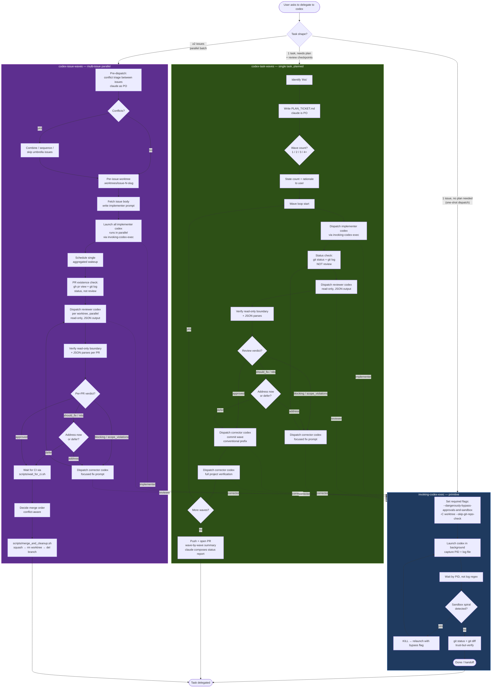

# Codex delegation flow

Single chart showing how `invoking-codex-exec`, `codex-task-waves`, and `codex-issue-waves` relate. Pick the entry by task shape; the lower skills layer on the primitive.

## Reading the chart

- **Entry decision** is `Task shape?` — pick exactly one path.
- **Dotted arrows** = layering, labeled with the codex role being dispatched. Every dispatch (implementer, reviewer, corrector) goes through `invoking-codex-exec`.
- **Claude is the PO; codex is the worker.** Claude plans, dispatches, reads structured outputs (JSON reviews), decides next dispatch, opens PRs (mechanical). Claude does not edit source files, does not read diffs for judgment, does not make in-place fixes. Every code touch — build, review, correction — is a codex dispatch.
- **Reviewer codex is read-only.** No native enforcement; the orchestrator checks `git rev-parse HEAD` + `git status --porcelain` snapshots before/after each reviewer run. Two consecutive boundary violations → escalate to user.
- **Status vs. review** distinction matters. `gh pr view`, `git log --oneline`, `git diff --stat`, CI rollups → status, claude does these. Reading the diff to judge content quality → review, dispatched to reviewer codex.
- **Worktree isolation** is universal. All three skills run codex pinned to a worktree via `-C <worktree>`. Reviewer codex runs in the same worktree as the implementer that produced the PR.
- **Trust-but-verify** is universal. After each dispatch, claude runs status checks (`git status`, `git log`); after each reviewer dispatch, claude additionally verifies the read-only boundary held.

## Skill picker — quick

| Trigger | Skill |
|---------|-------|
| "Run codex on this" / one-shot | `invoking-codex-exec` |
| "Have codex fix this ticket" / planned single task | `codex-task-waves` |
| "Spawn codex on issues #A #B #C" / parallel batch | `codex-issue-waves` |
