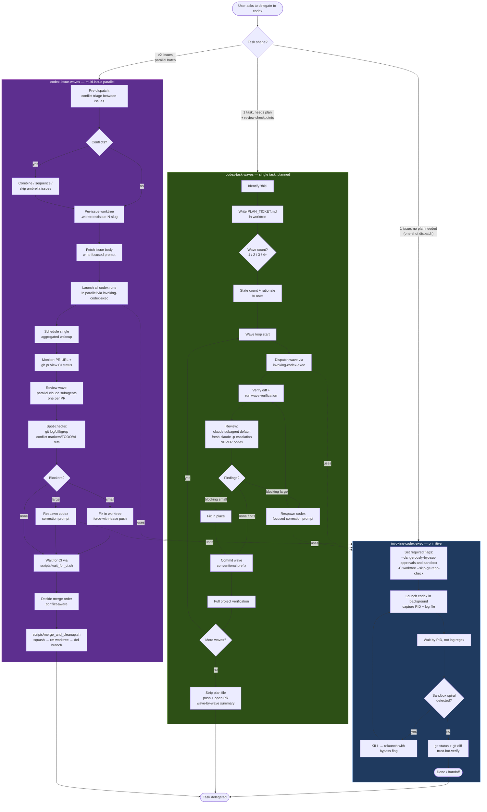

# Codex delegation flow

Single chart showing how `invoking-codex-exec`, `codex-task-waves`, and `codex-issue-waves` relate. Pick the entry by task shape; the lower skills layer on the primitive.

## Reading the chart

- **Entry decision** is `Task shape?` — pick exactly one path.
- **Dotted arrows** = layering. `codex-task-waves` and `codex-issue-waves` both *call* `invoking-codex-exec` for the actual codex launch; they don't reimplement flag handling or PID waits.
- **Reviewer is never codex.** All three paths use claude (in-harness subagent default, fresh `claude -p` for high-stakes). Codex = autonomous execution. Review = read+reason.
- **Worktree isolation** is universal. All three skills run codex pinned to a worktree via `-C <worktree>`.
- **Trust-but-verify** is universal. Always `git status` + `git diff` before declaring success or killing a stuck run.

## Skill picker — quick

| Trigger | Skill |
|---------|-------|
| "Run codex on this" / one-shot | `invoking-codex-exec` |
| "Have codex fix this ticket" / planned single task | `codex-task-waves` |
| "Spawn codex on issues #A #B #C" / parallel batch | `codex-issue-waves` |
